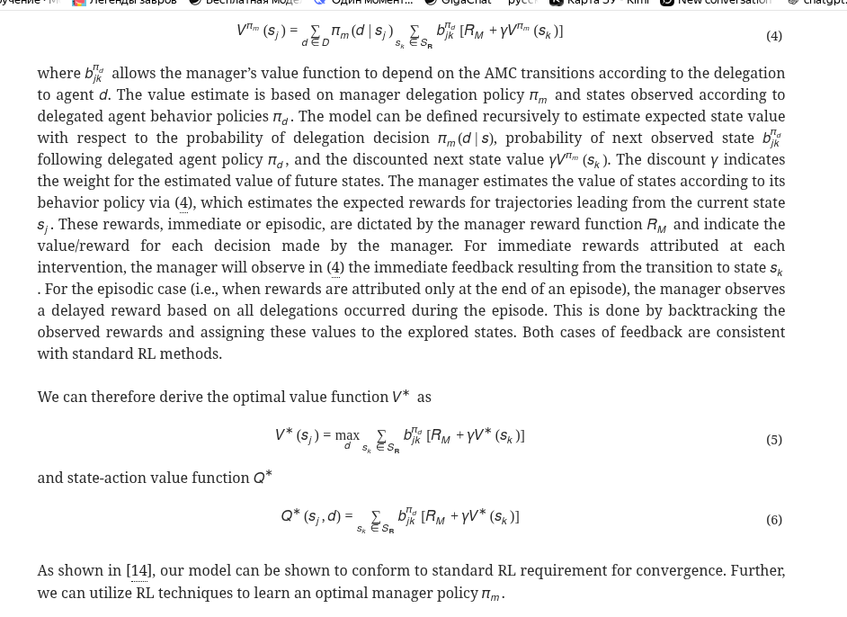
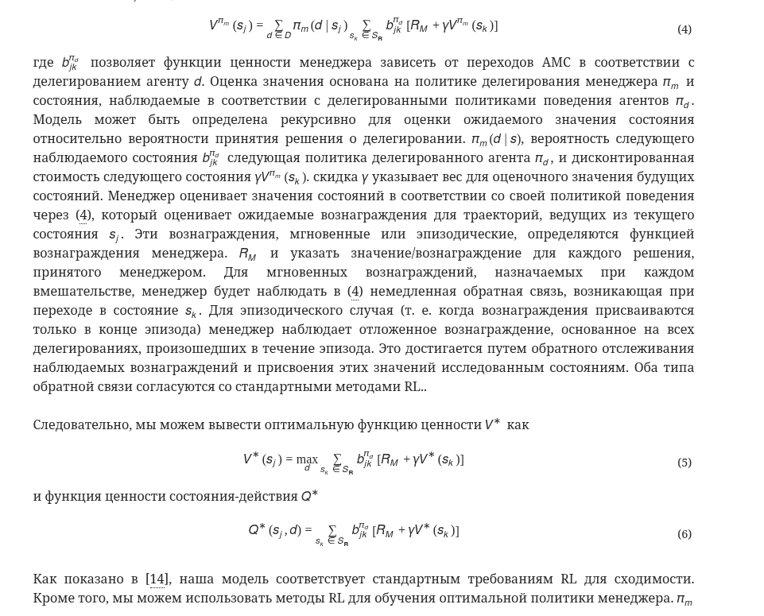

## Russian arXiv Digest

Русскоязычные переводы и краткие разборы arXiv статей  
по AI, ML, multi-agent systems и orchestration.

---

## Структура проекта
```
├── README.md                     # Главная страница репозитория и навигация по статьям
├── articles/                     # Каталог со всеми обработанными статьями
│   ├── 2403.08386/               # Каталог отдельной arXiv статьи
│   │   ├── [2403.08386]...       # Служебные CSS/JS/изображения для рэндэринга HTML
│   │   ├── 2403.08386.html       # Оригинальная HTML версия статьи с arXiv
│   │   ├── 2403.08386_ru.html    # Переведённая русскоязычная HTML версия статьи
│   │   ├── article_rag.json      # Структурированное AI/RAG представление статьи
│   │   ├── metadata.json         # Метаданные статьи, теги, summary и ссылки
│   │   └── README.md             # Краткий разбор статьи и основные выводы
│   ├── 2503.13754/               # Каталог другой статьи в аналогичном формате
```

В каждом каталоге находится зеркало оригинальной статьи, её перевод на русский язык и метаданные. 

Источником является **ar5iv.labs.arxiv.org** — проект, который предоставляет статьи arXiv в удобном responsive HTML5 формате (а не только PDF). Если свежая статья ещё не обработана ar5iv, оригинальный HTML берётся напрямую с arxiv.org.

Основной механизм перевода — автоматический перевод оригинального HTML в русскоязычную HTML-версию. Такой подход позволяет сохранить форматирование, формулы и изображения.

<p align="center">
  
  
</p>

## Тезисы

- Перевод на ~98% формируется автоматически
- Явные ошибки и несогласованности дорабатываются вручную
- Полученный перевод **не является** точным техническим переводом, часть недочётов сохраняется
- **Рекомендуется** читать вместе с оригиналом для получения полного контекста

## Возможность участия

Вы можете предлагать интересные статьи для перевода, присылать свои исправления, замечания по качеству переводов и активно обсуждать материалы.

---

## Последние статьи


---
---
## Последние статьи

### Healthcare AI GYM для медицинских агентов
[2605.02943] дата публикации в arXiv - 05.2026  
📅 дата перевода 17.05.2026  
🏷 `medical AI` `reinforcement learning` `multi-turn agents` `clinical reasoning` `tool-augmented LLMs` `on-policy distillation` `healthcare simulation`

Создана среда Healthcare AI GYM для обучения медицинских AI-агентов с подкреплением в многопоточном режиме. Предложен метод TT-OPD, стабилизирующий обучение через дистилляцию с учителем на основе EMA, что улучшает точность на 10 из 18 медицинских бенчмарков в среднем на 3.9 процентных пункта.

- [📖 Русская HTML версия](https://romanzorkin.github.io/arxiv_ru/articles/2605.02943/2605.02943_ru.html)
- [📄 Оригинальная статья](https://arxiv.org/abs/2605.02943v1)
- [🧠 Summary / README](articles/2605.02943/README.md)
- [⚙ Metadata](articles/2605.02943/metadata.json)

---

### YOLO26: Анализ сквозной структуры без NMS для обнаружения объектов в реальном времени
[2601.12882] дата публикации в arXiv - 01.2026  
📅 дата перевода 23.05.2026  
🏷 `YOLOv26` `real-time object detection` `NMS-free` `end-to-end detection` `MuSGD optimizer` `edge AI` `small object detection`

YOLOv26 — сквозной детектор без NMS, использующий MuSGD, STAL и ProgLoss. Достигает 40+ mAP на nano-версии за 1.5 мс и 57.5 mAP на extra-large за 11.5 мс, превосходя YOLO11 и RTMDet по скорости и точности.

- [📖 Русская HTML версия](https://romanzorkin.github.io/arxiv_ru/articles/2601.12882/2601.12882_ru.html)
- [📄 Оригинальная статья](https://arxiv.org/abs/2601.12882)
- [🧠 Summary / README](articles/2601.12882/README.md)
- [⚙ Metadata](articles/2601.12882/metadata.json)

---

### К агентивному управлению программными проектами: видение и дорожная карта
[2601.16392] дата публикации в arXiv - 01.2026  
📅 дата перевода 23.05.2026  
🏷 `agentic AI` `software project management` `multi-agent system` `human-AI collaboration` `autonomy levels` `software engineering 3.0` `ethical AI`

Предложена концепция агентного PM как мультиагентной системы с четырьмя режимами автономии, работающей как помощник человека. Статья описывает эволюцию SPM, этические аспекты и новую роль PM как коуча.

- [📖 Русская HTML версия](https://romanzorkin.github.io/arxiv_ru/articles/2601.16392/2601.16392_ru.html)
- [📄 Оригинальная статья](https://arxiv.org/abs/2601.16392)
- [🧠 Summary / README](articles/2601.16392/README.md)
- [⚙ Metadata](articles/2601.16392/metadata.json)

---

### Влияние LLM на командное сотрудничество в разработке программного обеспечения
[2510.08612] дата публикации в arXiv - 10.2025  
📅 дата перевода 23.05.2026  
🏷 `software engineering` `LLM` `team collaboration` `SDLC` `case study` `survey` `AI-assisted development`

Статья исследует влияние LLM-инструментов (GitHub Copilot, AI-ассистенты) на командную работу в SDLC. На основе опроса и двух кейсов показано повышение эффективности, улучшение коммуникации и документации; выявлены проблемы конфиденциальности и необходимости настройки.

- [📖 Русская HTML версия](https://romanzorkin.github.io/arxiv_ru/articles/2510.08612/2510.08612_ru.html)
- [📄 Оригинальная статья](https://arxiv.org/abs/2510.08612)
- [🧠 Summary / README](articles/2510.08612/README.md)
- [⚙ Metadata](articles/2510.08612/metadata.json)

---
### От автономных агентов к интегрированным системам, новая парадигма: оркестрованный распределенный интеллект
[2503.13754] дата публикации в arXiv - 03.2025  
📅 дата перевода 23.05.2026  
🏷 `multi-agent systems` `orchestration layer` `human-AI synergy` `systems thinking` `enterprise AI` `cognitive density` `systems of action`

Предложена парадигма Orchestrated Distributed Intelligence (ODI), в которой AI рассматривается не как набор изолированных агентов, а как оркестрованные сети, интегрированные с человеческими процессами принятия решений, с акцентом на когнитивную плотность, многоуровневую обратную связь и переход от систем записи к системам действия.

- [📖 Русская HTML версия](https://romanzorkin.github.io/arxiv_ru/articles/2503.13754/2503.13754_ru.html)
- [📄 Оригинальная статья](https://arxiv.org/abs/2503.13754)
- [🧠 Summary / README](articles/2503.13754/README.md)
- [⚙ Metadata](articles/2503.13754/metadata.json)

---
### Оптимизация избегающих риска гибридных команд человек-ИИ
[2403.08386] дата публикации в arXiv - 03.2024  
📅 дата перевода 24.05.2026  
🏷 `human-ai teams` `reinforcement learning` `risk aversion` `delegation` `grid navigation` `hybrid team management` `intervening MDP`

Предложен RL-менеджер, делегирующий решения между агентами (человек/ИИ) в гибридной команде. Менеджер учится минимизировать вмешательства и риск, достигая near-optimal путей в grid-средах с failure-состояниями.

- [📖 Русская HTML версия](https://romanzorkin.github.io/arxiv_ru/articles/2403.08386/2403.08386_ru.html)
- [📄 Оригинальная статья](https://arxiv.org/abs/2403.08386)
- [🧠 Summary / README](articles/2403.08386/README.md)
- [⚙ Metadata](articles/2403.08386/metadata.json)

---
### Усиление командной работы с помощью ИИ-агентов в качестве пространственных коллабораторов
[2503.09794] дата публикации в arXiv - 03.2025  
📅 дата перевода 24.05.2026  
🏷 `augmented reality` `human-AI teams` `team dynamics` `spatial AI agents` `immersive collaboration` `proxemics` `context-aware AI`

Позиционная статья, предлагающая проектировать AI-агентов в AR как пространственно-осведомлённых членов команды, а не статичных ассистентов. Авторы ставят 4 исследовательских вопроса по дизайну, пространственным факторам, воплощению и моменту вмешательства таких агентов.

- [📖 Русская HTML версия](https://romanzorkin.github.io/arxiv_ru/articles/2503.09794/2503.09794_ru.html)
- [📄 Оригинальная статья](https://arxiv.org/abs/2503.09794)
- [🧠 Summary / README](articles/2503.09794/README.md)
- [⚙ Metadata](articles/2503.09794/metadata.json)

---
### Повышение продуктивности и благополучия на рабочем месте с помощью ИИ-агентов
[2501.02368] дата публикации в arXiv - 01.2025  
📅 дата перевода 24.05.2026  
🏷 `AI agents` `workplace productivity` `neuroeconomic models` `reinforcement learning` `adaptive gamification` `employee well-being` `hierarchical RL`

Предлагается AI-фреймворк, интегрирующий машинное обучение с нейробиологическими данными для повышения производительности труда и благополучия сотрудников. Использует HRL, MORL, value alignment и биометрическую обратную связь для адаптивной геймификации и приоритизации задач. Работа основана на симулированных данных.

- [📖 Русская HTML версия](https://romanzorkin.github.io/arxiv_ru/articles/2501.02368/2501.02368_ru.html)
- [📄 Оригинальная статья](https://arxiv.org/abs/2501.02368)
- [🧠 Summary / README](articles/2501.02368/README.md)
- [⚙ Metadata](articles/2501.02368/metadata.json)

---
### Распределенное познание для удаленных операций с поддержкой ИИ: вызовы и направления исследований
[2504.14996] дата публикации в arXiv - 04.2025  
📅 дата перевода 24.05.2026  
🏷 `distributed cognition` `team cognition` `human-AI teaming` `remote operations` `intelligent ports` `AI memory` `fallback operator`

Статья анализирует влияние интеграции AI на распределенное и командное познание в удаленных операциях. На примере интеллектуальных портов выделены три ключевые области: реконфигурация человеко-AI команд, адаптивная память AI и AI как резервный оператор при сбоях связи.

- [📖 Русская HTML версия](https://romanzorkin.github.io/arxiv_ru/articles/2504.14996/2504.14996_ru.html)
- [📄 Оригинальная статья](https://arxiv.org/abs/2504.14996)
- [🧠 Summary / README](articles/2504.14996/README.md)
- [⚙ Metadata](articles/2504.14996/metadata.json)

---

## О проекте


Проект — личный research digest и открытый архив
интересных научных материалов.


## Архив статей

|id статьи|Месяц публикации|Дата перевода| Тема статьи | Ручной контроль|
|---|---|---|---|---|
| [2605.02943](articles/2605.02943/README.md) | 05.2026 | 17.05.2026 | Healthcare AI GYM для медицинских агентов (`Healthcare AI GYM for Medical Agents`) |✅ |
| [2601.12882](articles/2601.12882/README.md) | 01.2026 | 23.05.2026 | YOLO26: Анализ сквозной структуры без NMS для обнаружения объектов в реальном времени (`YOLO26: An Analysis of NMS-Free End to End Framework for Real-Time Object Detection`) |✅ |
| [2601.16392](articles/2601.16392/README.md) | 01.2026 | 23.05.2026 | К агентивному управлению программными проектами: видение и дорожная карта (`Toward Agentic Software Project Management: A Vision and Roadmap`) |✅ |
| [2510.08612](articles/2510.08612/README.md) | 10.2025 | 23.05.2026 | Влияние LLM на командное сотрудничество в разработке программного обеспечения (`Impact of LLMs on Team Collaboration in Software Development`) |✅ |
| [2503.13754](articles/2503.13754/README.md) | 03.2025 | 23.05.2026 | От автономных агентов к интегрированным системам, новая парадигма: оркестрованный распределенный интеллект (`From Autonomous Agents to Integrated Systems, A New Paradigm: Orchestrated Distributed Intelligence`) ||
| [2403.08386](articles/2403.08386/README.md) | 03.2024 | 24.05.2026 | Оптимизация избегающих риска гибридных команд человек-ИИ (`Optimizing Risk-averse Human-AI Hybrid Teams`) |✅ |
| [2503.09794](articles/2503.09794/README.md) | 03.2025 | 24.05.2026 | Усиление командной работы с помощью ИИ-агентов в качестве пространственных коллабораторов (`Augmenting Teamwork through AI Agents as Spatial Collaborators`) ||
| [2501.02368](articles/2501.02368/README.md) | 01.2025 | 24.05.2026 | Повышение продуктивности и благополучия на рабочем месте с помощью ИИ-агентов (`Enhancing Workplace Productivity and Well-Being using AI Agents`) ||
| [2504.14996](articles/2504.14996/README.md) | 04.2025 | 24.05.2026 | Распределенное познание для удаленных операций с поддержкой ИИ: вызовы и направления исследований (`Distributed Cognition for AI-supported Remote Operations: Challenges and Research Directions`) ||
| [2605.99001](articles/2605.99001/README.md) | 05.2026 | 24.05.2026 | DeepSeek-V4: На пути к высокоэффективному интеллекту контекста из миллиона токенов (`DeepSeek-V4: Towards Highly Efficient Million-Token Context Intelligence`) ||
| [1810.04805](articles/1810.04805/README.md) | 10.2018 | 24.05.2026 | BERT : Предварительное обучение глубоких двунаправленных трансформеров для Понимание языка (`BERT : Pre-training of Deep Bidirectional Transformers for Language Understanding`) ||
| [1506.02640](articles/1506.02640/README.md) | 06.2015 | 24.05.2026 | Вы смотрите только один раз: Унифицированное обнаружение объектов в реальном времени (`You Only Look Once: Unified, Real-Time Object Detection`) ||
| [1706.03762](articles/1706.03762/README.md) | 06.2017 | 24.05.2026 | Внимание — это всё, что вам нужно (`Attention Is All You Need`) ||
| [1512.03385](articles/1512.03385/README.md) | 12.2015 | 24.05.2026 | Глубокое остаточное обучение для распознавания изображений (`Deep Residual Learning for Image Recognition`) ||
| [1710.10903](articles/1710.10903/README.md) | 10.2017 | 24.05.2026 | Графовые сети внимания (`Graph Attention Networks`) ||
| [1910.01736](articles/1910.01736/README.md) | 10.2019 | 24.05.2026 | Контекстно-зависимые графовые сети внимания (`Context-Aware Graph Attention Networks`) ||
| [2010.11929](articles/2010.11929/README.md) | 10.2020 | 24.05.2026 | Изображение стоит 16x16 слов: Трансформеры для распознавания изображений в масштабе (`An Image is Worth 16x16 Words: Transformers for Image Recognition at Scale`) ||
| [2005.14165](articles/2005.14165/README.md) | 05.2020 | 24.05.2026 | Языковые модели — обучающиеся с несколькими примерами (`Language Models are Few-Shot Learners`) ||
