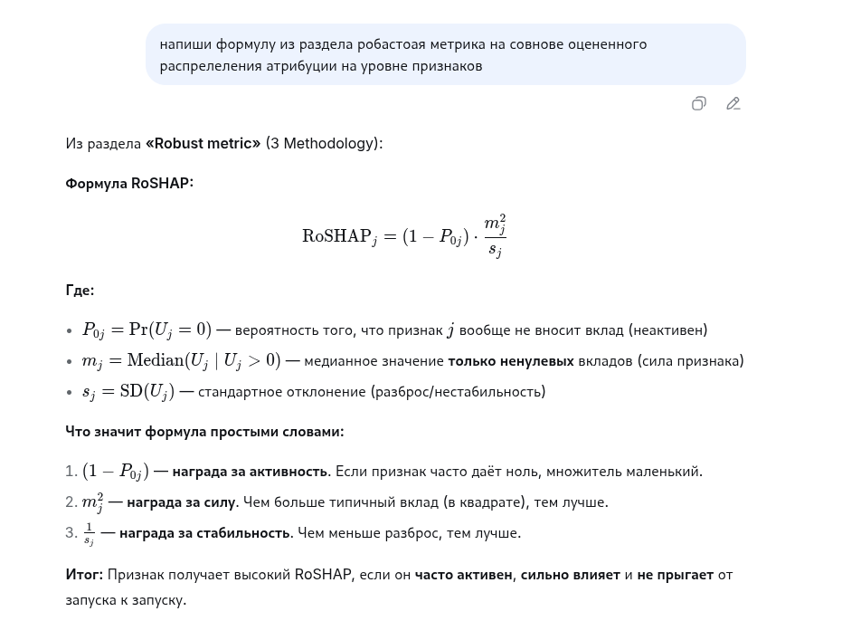

[](https://github.com/RomanZorkin/arxiv_ru)


## Russian arXiv Digest | arxiv_ru

Русскоязычные переводы и краткие разборы arXiv статей  по AI, ML, multi-agent systems и orchestration.
Новости о еженедельных обновлениях публикуются в сообществе https://t.me/pythonbarnaul

---

🤖 LLM / Agents

Для навигации по репозиторию используйте:

[repository_map.json](https://github.com/RomanZorkin/arxiv_ru/blob/main/repository_map.json) — структура проекта и правила навигации

[knowledge_index.json](https://github.com/RomanZorkin/arxiv_ru/blob/main/knowledge_index.json) — индекс всех статей и метаданные


LLM должна начинать работу с этих файлов, а не с обхода каталога articles/.

---


## Структура проекта
```
├── README.md                     # Главная страница репозитория и навигация по статьям
├── articles/                     # Каталог со всеми обработанными статьями
│   ├── 2403.08386/               # Каталог отдельной arXiv статьи
│   │   ├── [2403.08386]...       # Служебные CSS/JS/изображения для рэндэринга HTML
│   │   ├── 2403.08386.html       # Оригинальная HTML версия статьи с arXiv
│   │   ├── 2403.08386_ru.html    # Переведённая русскоязычная HTML версия статьи
│   │   ├── article_rag.json      # Структурированное AI/RAG представление статьи
│   │   ├── metadata.json         # Метаданные статьи, теги, summary и ссылки
│   │   └── README.md             # Краткий разбор статьи и основные выводы
│   ├── 2503.13754/               # Каталог другой статьи в аналогичном формате
```

В каждом каталоге находится зеркало оригинальной статьи, её перевод на русский язык и метаданные. 

Источником является **ar5iv.labs.arxiv.org** — проект, который предоставляет статьи arXiv в удобном responsive HTML5 формате (а не только PDF). Если свежая статья ещё не обработана ar5iv, оригинальный HTML берётся напрямую с arxiv.org.

Основной механизм перевода — автоматический перевод оригинального HTML в русскоязычную HTML-версию. Такой подход позволяет сохранить форматирование, формулы и изображения.

<p align="center">
  
  
</p>

## Тезисы

- Перевод на ~98% формируется автоматически
- Явные ошибки и несогласованности дорабатываются вручную
- Полученный перевод **не является** точным техническим переводом, часть недочётов сохраняется
- **Рекомендуется** читать вместе с оригиналом для получения полного контекста

## Сила Rag

В каталоге статьи находится файл article_rag.json — это структурированное AI/RAG-представление статьи.

При изучении статьи я прикрепляю этот файл к чату (ChatGPT, DeepSeek, и т.д.), объясняю, что это контекст нашей беседы, и по мере возникновения вопросов прошу модель просто объяснить мне интересующие моменты.

Результат — просто пушка 🚀
Ниже приведен скрин одной из таких бесед:
<p align="center">
  
</p>

В LLM был загружен только JSON-файл статьи [RoSHAP](https://arxiv.org/html/2605.15154), после чего был задан вопрос, вырванный из контекста.

Обратите внимание, насколько подробно и структурированно был получен ответ, включая объяснения и формулы.

## Возможность участия

Вы можете предлагать интересные статьи для перевода, присылать свои исправления, замечания по качеству переводов и активно обсуждать материалы.

---

# 🔥 Последние статьи
> Новые переводы и разборы arXiv-статей
---

### Переосмысление ранней остановки: уточните, затем откалибруйте
[2501.19195] дата публикации в arXiv - 01.2025  
📅 дата перевода 06.06.2026  
🏷 `calibration error` `refinement error` `early stopping` `temperature scaling` `probabilistic classification` `logistic regression` `model calibration`

Авторы показывают, что минимизация функции потерь при обучении классификаторов не приводит к одновременному снижению ошибок калибровки и уточнения. Предлагается новый критерий ранней остановки, основанный на минимизации ошибки уточнения, а калибровка проводится постфактум с помощью temperature scaling, что улучшает качество вероятностных предсказаний.

- [📖 Русская HTML версия](https://romanzorkin.github.io/arxiv_ru/articles/2501.19195/2501.19195_ru.html)
- [📄 Оригинальная статья](https://arxiv.org/abs/2501.19195)
- [🧠 Summary / README](articles/2501.19195/README.md)
- [⚙ Metadata](articles/2501.19195/metadata.json)

---

### SeGuE: Семантически управляемое исследование для мобильных роботов
[2504.03629] дата публикации в arXiv - 04.2025  
📅 дата перевода 01.06.2026  
🏷 `semantic mapping` `next-best-view` `mobile robots` `semantic features` `importance sampling` `autonomous exploration` `embodied AI`

Предложен метод SeGuE для автономного исследования мобильным роботом, который строит карту с семантическими признаками, используя оценку энтропии видимых семантических признаков для выбора следующей точки обзора. Метод проверен в симуляции и на реальном роботе, показывая улучшение качества семантических карт по сравнению с базовыми подходами.

- [📖 Русская HTML версия](https://romanzorkin.github.io/arxiv_ru/articles/2504.03629/2504.03629_ru.html)
- [📄 Оригинальная статья](https://arxiv.org/abs/2504.03629)
- [🧠 Summary / README](articles/2504.03629/README.md)
- [⚙ Metadata](articles/2504.03629/metadata.json)

---

### BLASST: динамическое блочное разрежение механизма внимания с использованием порогового отсечения Softmax
[2512.12087] дата публикации в arXiv - 12.2025  
📅 дата перевода 31.05.2026  
🏷 `sparse attention` `FlashAttention` `CUDA kernels` `long-context inference` `threshold pruning` `sparsity-aware training` `Llama-3.1-8B`

BLASST — метод динамического разрежения внимания, который без предвычислений и прокси-оценок пропускает незначимые блоки внимания, достигая до 1.62× ускорения при 74.7% разреженности с минимальной потерей точности на современных GPU.

- [📖 Русская HTML версия](https://romanzorkin.github.io/arxiv_ru/articles/2512.12087/2512.12087_ru.html)
- [📄 Оригинальная статья](https://arxiv.org/abs/2512.12087)
- [🧠 Summary / README](articles/2512.12087/README.md)
- [⚙ Metadata](articles/2512.12087/metadata.json)

---

### Finch: Бенчмаркинг финансов и бухгалтерии в корпоративных рабочих процессах, основанных на таблицах
[2512.13168] дата публикации в arXiv - 12.2025  
📅 дата перевода 01.06.2026  
🏷 `finance workflows` `spreadsheet reasoning` `large language models` `multimodal data` `workflow benchmarking` `enterprise AI` `long-horizon tasks`

Finch — это новый комплексный бенчмарк для оценки ИИ-агентов на реальных финансово-бухгалтерских рабочих процессах, основанных на сложных, разнородных и многомодальных данных из электронных таблиц и сопутствующих документов. Даже передовые модели проходят менее 40% задач, демонстрируя значительные вызовы.

- [📖 Русская HTML версия](https://romanzorkin.github.io/arxiv_ru/articles/2512.13168/2512.13168_ru.html)
- [📄 Оригинальная статья](https://arxiv.org/abs/2512.13168)
- [🧠 Summary / README](articles/2512.13168/README.md)
- [⚙ Metadata](articles/2512.13168/metadata.json)

---

### К парадигме «Зрение–Звук–Язык–Действие»: фреймворк HEAR для манипулирования, ориентированного на звук
[2603.16086] дата публикации в arXiv - 03.2026  
📅 дата перевода 01.06.2026  
🏷 `robotic manipulation` `audio perception` `vision-language-action` `streaming audio` `causal memory` `flow-matching policy` `multi-sensory integration`

Предложена парадигма VSLA и архитектура HEAR для звукоцентричного управления роботами, решающая проблему потери кратковременных аудиосигналов из-за задержек и пакетной обработки действий. HEAR достигает 81% успеха в симуляции и 54% на реальном роботе, существенно превосходя существующие методы.

- [📖 Русская HTML версия](https://romanzorkin.github.io/arxiv_ru/articles/2603.16086/2603.16086_ru.html)
- [📄 Оригинальная статья](https://arxiv.org/abs/2603.16086)
- [🧠 Summary / README](articles/2603.16086/README.md)
- [⚙ Metadata](articles/2603.16086/metadata.json)

---

### Агентное использование инструментов в больших языковых моделях
[2604.00835] дата публикации в arXiv - 04.2026  
📅 дата перевода 01.06.2026  
🏷 `large language models` `tool use` `reinforcement learning` `supervised fine-tuning` `prompt engineering` `autonomous agents` `evaluation benchmarks`

Статья систематизирует методы использования инструментов большими языковыми моделями (LLM) в трёх парадигмах: plug-and-play prompting, supervised tool learning и reward-driven policy learning, анализирует их эволюцию, сильные и слабые стороны, а также обзор существующих бенчмарков и вызовов.

- [📖 Русская HTML версия](https://romanzorkin.github.io/arxiv_ru/articles/2604.00835/2604.00835_ru.html)
- [📄 Оригинальная статья](https://arxiv.org/abs/2604.00835)
- [🧠 Summary / README](articles/2604.00835/README.md)
- [⚙ Metadata](articles/2604.00835/metadata.json)

---

### Реализуемая Байесовская согласованность для общих функций потерь метрик
[2605.03823] дата публикации в arXiv - 05.2026  
📅 дата перевода 06.06.2026  
🏷 `metric learning` `Bayes consistency` `Littlestone tree` `universal learning` `unbounded loss` `realizable setting` `combinatorial characterization`

Статья даёт необходимое и достаточное условие для сильной универсальной байесовской сходимости в реализуемой постановке при общих метрических потерях. Ключевой критерий — отсутствие бесконечного неубывающего Littlestone-дерева с растущими разрывами.

- [📖 Русская HTML версия](https://romanzorkin.github.io/arxiv_ru/articles/2605.03823/2605.03823_ru.html)
- [📄 Оригинальная статья](https://arxiv.org/abs/2605.03823)
- [🧠 Summary / README](articles/2605.03823/README.md)
- [⚙ Metadata](articles/2605.03823/metadata.json)

---

## О проекте


Проект — личный research digest и открытый архив интересных научных материалов.


## Архив статей

|id статьи|Месяц публикации|Дата перевода| Тема статьи | Ручной контроль|
|---|---|---|---|---|
| [2501.19195](articles/2501.19195/README.md) | 01.2025 | 06.06.2026 | Переосмысление ранней остановки: уточните, затем откалибруйте (`Rethinking Early Stopping: Refine, Then Calibrate`) |✅|
| [2504.03629](articles/2504.03629/README.md) | 04.2025 | 01.06.2026 | SeGuE: Семантически управляемое исследование для мобильных роботов (`SeGuE: Semantic Guided Exploration for Mobile Robots`) |✅|
| [2512.12087](articles/2512.12087/README.md) | 12.2025 | 31.05.2026 | BLASST: динамическое блочное разрежение механизма внимания с использованием порогового отсечения Softmax (`BLASST: Dynamic BLocked Attention Sparsity via Softmax Thresholding`) |✅|
| [2512.13168](articles/2512.13168/README.md) | 12.2025 | 01.06.2026 | Finch: Бенчмаркинг финансов и бухгалтерии в корпоративных рабочих процессах, основанных на таблицах (`Finch: Benchmarking Finance & Accounting across Spreadsheet-Centric Enterprise Workflows`) |✅|
| [2603.16086](articles/2603.16086/README.md) | 03.2026 | 01.06.2026 | К парадигме «Зрение–Звук–Язык–Действие»: фреймворк HEAR для манипулирования, ориентированного на звук (`Towards the Vision-Sound-Language-Action Paradigm: The HEAR Framework for Sound-Centric Manipulation`) |✅|
| [2604.00835](articles/2604.00835/README.md) | 04.2026 | 01.06.2026 | Агентное использование инструментов в больших языковых моделях (`Agentic Tool Use in Large Language Models`) |✅|
| [2604.00835](articles/2604.00835/README.md) | 04.2026 | 01.06.2026 | Агентное использование инструментов в больших языковых моделях (`Agentic Tool Use in Large Language Models`) |✅|
| [2605.03823](articles/2605.03823/README.md) | 05.2026 | 06.06.2026 | Реализуемая Байесовская согласованность для общих функций потерь метрик (`Realizable Bayes-Consistency for General Metric Losses`) |✅|
| [2601.06707](articles/2601.06707/README.md) | 01.2026 | 25.05.2026 | Оценка способностей к бухгалтерским рассуждениям больших языковых моделей (`Evaluating Accounting Reasoning Capabilities of Large Language Models`) |✅|
| [2307.05845](articles/2307.05845/README.md) | 07.2023 | 25.05.2026 | PIGEON: Прогнозирование геолокаций изображений (`PIGEON: Predicting Image Geolocations`) ||
| [2605.06226](articles/2605.06226/README.md) | 05.2026 | 24.05.2026 | Универсальный ИИ-агент для диагностики редких заболеваний и приоритизации генов риска (`A Versatile AI Agent for Rare Disease Diagnosis and Risk Gene Prioritization`) |✅|
| [2605.15154](articles/2605.15154/README.md) | 05.2026 | 24.05.2026 | RoSHAP: распределительный фреймворк и робастная метрика для стабильной атрибуции признаков (`RoSHAP: A Distributional Framework and Robust Metric for Stable Feature Attribution`) |✅|
| [2605.02943](articles/2605.02943/README.md) | 05.2026 | 17.05.2026 | Healthcare AI GYM для медицинских агентов (`Healthcare AI GYM for Medical Agents`) |✅|
| [2601.12882](articles/2601.12882/README.md) | 01.2026 | 23.05.2026 | YOLO26: Анализ сквозной структуры без NMS для обнаружения объектов в реальном времени (`YOLO26: An Analysis of NMS-Free End to End Framework for Real-Time Object Detection`) |✅|
| [2601.16392](articles/2601.16392/README.md) | 01.2026 | 23.05.2026 | К агентивному управлению программными проектами: видение и дорожная карта (`Toward Agentic Software Project Management: A Vision and Roadmap`) |✅|
| [2510.08612](articles/2510.08612/README.md) | 10.2025 | 23.05.2026 | Влияние LLM на командное сотрудничество в разработке программного обеспечения (`Impact of LLMs on Team Collaboration in Software Development`) |✅|
| [2503.13754](articles/2503.13754/README.md) | 03.2025 | 23.05.2026 | От автономных агентов к интегрированным системам, новая парадигма: оркестрованный распределенный интеллект (`From Autonomous Agents to Integrated Systems, A New Paradigm: Orchestrated Distributed Intelligence`) ||
| [2403.08386](articles/2403.08386/README.md) | 03.2024 | 24.05.2026 | Оптимизация избегающих риска гибридных команд человек-ИИ (`Optimizing Risk-averse Human-AI Hybrid Teams`) |✅|
| [2503.09794](articles/2503.09794/README.md) | 03.2025 | 24.05.2026 | Усиление командной работы с помощью ИИ-агентов в качестве пространственных коллабораторов (`Augmenting Teamwork through AI Agents as Spatial Collaborators`) ||
| [2501.02368](articles/2501.02368/README.md) | 01.2025 | 24.05.2026 | Повышение продуктивности и благополучия на рабочем месте с помощью ИИ-агентов (`Enhancing Workplace Productivity and Well-Being using AI Agents`) ||
| [2504.14996](articles/2504.14996/README.md) | 04.2025 | 24.05.2026 | Распределенное познание для удаленных операций с поддержкой ИИ: вызовы и направления исследований (`Distributed Cognition for AI-supported Remote Operations: Challenges and Research Directions`) ||
| [2605.99001](articles/2605.99001/README.md) | 05.2026 | 24.05.2026 | DeepSeek-V4: На пути к высокоэффективному интеллекту контекста из миллиона токенов (`DeepSeek-V4: Towards Highly Efficient Million-Token Context Intelligence`) ||
| [1810.04805](articles/1810.04805/README.md) | 10.2018 | 24.05.2026 | BERT : Предварительное обучение глубоких двунаправленных трансформеров для Понимание языка (`BERT : Pre-training of Deep Bidirectional Transformers for Language Understanding`) ||
| [1506.02640](articles/1506.02640/README.md) | 06.2015 | 24.05.2026 | Вы смотрите только один раз: Унифицированное обнаружение объектов в реальном времени (`You Only Look Once: Unified, Real-Time Object Detection`) ||
| [1706.03762](articles/1706.03762/README.md) | 06.2017 | 24.05.2026 | Внимание — это всё, что вам нужно (`Attention Is All You Need`) ||
| [1512.03385](articles/1512.03385/README.md) | 12.2015 | 24.05.2026 | Глубокое остаточное обучение для распознавания изображений (`Deep Residual Learning for Image Recognition`) ||
| [1710.10903](articles/1710.10903/README.md) | 10.2017 | 24.05.2026 | Графовые сети внимания (`Graph Attention Networks`) ||
| [1910.01736](articles/1910.01736/README.md) | 10.2019 | 24.05.2026 | Контекстно-зависимые графовые сети внимания (`Context-Aware Graph Attention Networks`) ||
| [2010.11929](articles/2010.11929/README.md) | 10.2020 | 24.05.2026 | Изображение стоит 16x16 слов: Трансформеры для распознавания изображений в масштабе (`An Image is Worth 16x16 Words: Transformers for Image Recognition at Scale`) ||
| [2005.14165](articles/2005.14165/README.md) | 05.2020 | 24.05.2026 | Языковые модели — обучающиеся с несколькими примерами (`Language Models are Few-Shot Learners`) ||
